  

# Awesome Push Notifications 🔔 🚀

A curated list of leading platforms, libraries, and frameworks for sending, managing, and optimizing push notifications across mobile (iOS & Android), web browsers, and multi-channel customer engagement. 📱 💬

**Primary focus: open-source software and developer autonomy.** 🌟

Commercial / hosted SaaS platforms are listed separately with detailed revenue valuation metrics and pricing tiers for full market clarity. Open-source alternatives and community tools are highlighted throughout. 💡

---

## 📋 Table of Contents
- [🏢 SaaS / Hosted Platforms](#-saas--hosted-platforms)
- [🔓 Open-Source Softwares](#-open-source-softwares)
  - [⚡ Core Frameworks & Servers](#-core-frameworks--servers)
  - [📦 Specialized Libraries & SDKs](#-specialized-libraries--sdks)
  - [🛠️ Additional Notable Open-Source Tools](#️-additional-notable-open-source-tools)
- [🎯 Quick Start Recommendations](#-quick-start-recommendations)
- [📈 Star History](#-star-history)
- [🤝 Contributing](#-contributing)

---

## 🏢 SaaS / Hosted Platforms

Below is a comparison of major commercial customer engagement and push notification SaaS platforms, ordered by company size (Revenue / Market Valuation, descending). 📊

| Platform 🌐 | Description 📝 | Key Focus 🎯 | Company Size (Revenue / Valuation) 💰 | Starting Tier Pricing 💵 | Free Tier / Trial Limits 🎁 |
|:---|:---|:---|:---|:---|:---|
| **[Braze](https://www.braze.com/)** | Customer engagement platform focused on personalized, cross-channel messaging including rich push, Intelligent Timing, Canvas journeys, and deep analytics. 🚀 | Enterprise personalization & omnichannel journeys | **$738.2M** annual revenue (FY26) / **~$3.5B+** Public Market Cap | Custom quote-based pricing (driven by MAU & Action Credits) | 14-day free trial (guided product access; extended access for eligible startups via Startups Program) |
| **[CleverTap](https://clevertap.com/)** | Retention and engagement platform with powerful segmentation, real-time triggers, rich push, Notification Inbox, and detailed analytics. 📈 | User retention & behavior-based campaigns | **$775M** valuation / **~$60M+** ARR | Essentials plan starts at $75/month (up to 5,000 MAU) | 30-day free trial for apps under 100,000 MAU |
| **[MoEngage](https://www.moengage.com/)** | Customer engagement platform with AI-powered personalized push, rich media, Notification Center, event-triggered campaigns, and multi-channel orchestration. 🧠 | AI-driven personalization & lifecycle campaigns | **$500M+** estimated valuation / **~$40M+** ARR | Standard plan starts at ~$999/month (up to 10k MAU) | 30-day free trial available for specific features (Landing Pages); custom sales demo required for main platform |
| **[Airship](https://www.airship.com/)** | Enterprise customer engagement platform with push, in-app messages, Message Center, SMS/MMS/RCS, email, Live Activities, and advanced orchestration. ✈️ | Enterprise mobile engagement & multi-channel journeys | **$300M+** estimated valuation / **~$58M** estimated ARR | Custom Enterprise pricing (sales-led contact required) | Proof-of-concept / pilot program available upon request (No permanent free plan) |
| **[Iterable](https://iterable.com/)** | Growth marketing platform with push (standard + silent), journeys, segmentation, and multi-channel orchestration (email, SMS, push, in-app). 🔄 | Cross-channel journeys & growth marketing | **$250M+** funding / **~$50M+** ARR | Custom annual contract pricing (sales-led, based on MAUs & message volume) | No free tier or trial (Demo requested via sales team) |
| **[OneSignal](https://onesignal.com/)** | Complete platform for push notifications across mobile, web, and desktop. Supports campaigns, Journeys, segmentation, A/B testing, personalization, and multi-channel messaging (push, email, SMS, in-app). ⚡ | High-volume engagement, free tier for small scale | **$200M+** estimated valuation / **~$21.6M** ARR | Growth plan from $19/month | Free forever for <1,000 MAU (mobile push & in-app), up to 10,000 web push subscribers at a time, and 10,000 emails/month |
| **[Pushwoosh](https://www.pushwoosh.com/)** | Omnichannel customer engagement platform supporting push, in-app, email, SMS, WhatsApp, and more. High throughput (up to 500k pushes/sec), segmentation, and AI-assisted campaigns. 📲 | Omnichannel messaging & high-volume delivery | **$50M+** estimated valuation / **~$10M** ARR | Omnichannel plan from $13 per additional 1,000 MAU above free tier | Free forever up to 1,000 MAU (unlimited push/in-app sends) and 20,000 emails/month |
| **[WebEngage](https://webengage.com/)** | Full-stack customer engagement platform supporting mobile/web push, in-app, email, SMS, and WhatsApp with real-time segmentation and journey builders. 🎯 | Omnichannel engagement & personalization | **$40M+** estimated valuation / **~$8M** ARR | Custom tiered plans (Solo / Band / Enterprise tiers based on MAU volume) | 14-day free trial available upon demo / account registration |
| **[WonderPush](https://www.wonderpush.com/)** | Developer-friendly push platform for web and mobile. Fast delivery (350k/sec), GDPR-compliant, full-featured from low pricing, with automation, segmentation, and A/B testing. ⚡ | Affordable full-featured push for web + mobile | **$10M+** estimated valuation / **~$2M** ARR | Paid plans start at €1/month (+ €1 per 1,000 extra subscribers) | 14-day free trial (all features included, no credit card required) |
| **[Firebase Cloud Messaging (FCM)](https://firebase.google.com/products/cloud-messaging)** | Google’s free, reliable messaging service for iOS, Android, and web. Supports topics, device targeting, data messages, and integration with Analytics/A/B testing. 🔥 | Free transport layer & Android-native push | **Part of Alphabet/Google** ($2T+ Market Cap) | $0 / Month (100% Free Service) | Free forever with unlimited push notification sends and no subscriber caps |

---

## 🔓 Open-Source Softwares

These open-source notification platforms and libraries form the core ecosystem for self-hosted, privacy-focused, or developer-controlled push notification systems. Most can integrate with APNs, FCM, Web Push standard, or act as independent delivery layers. 🛡️

### ⚡ Core Frameworks & Servers

Sorted by GitHub Star count (descending). ⭐

| Project 🛠️ | Star Count 🌟 | Description 📝 | License 📜 | Notes 💡 |
|:---|:---|:---|:---|:---|
| **[Novu](https://github.com/novuhq/novu)** |  | Open-source notification infrastructure platform. Unified API for push, email, SMS, in-app, and chat with workflows, templates, digests, and subscriber preferences. ⚡ | MIT (Open Core) | Dominant multi-channel open-source solution |
| **[ntfy](https://github.com/binwiederhier/ntfy)** |  | Lightweight HTTP pub/sub push notification server. Publish via simple PUT/POST; clients receive on Android, iOS, web, or desktop. Supports UnifiedPush, priorities, attachments, and action buttons. 📲 | Apache 2.0 / GPL 2.0 | Best overall self-hosted option; public instance at ntfy.sh |
| **[Apprise](https://github.com/caronc/apprise)** |  | Notification library that can push to 100+ services (Slack, Discord, Telegram, email, SMS, push services, etc.) from a single API. 📣 | BSD 3-Clause | Best as a multi-service relay / fan-out tool |
| **[Gotify](https://github.com/gotify/server)** |  | Simple self-hosted server for sending/receiving real-time messages via REST + WebSocket. Includes web UI, Android app, application tokens, and plugin system. 🔒 | MIT | Lightweight, excellent for private notifications |
| **[Centrifugo](https://github.com/centrifugal/centrifugo)** |  | Scalable real-time messaging server with WebSockets, SSE, gRPC. Often used for live notifications, presence, and pub/sub. ⚡ | Apache 2.0 | Strong for real-time / in-app notification fan-out |
| **[Gorush](https://github.com/appleboy/gorush)** |  | Push notification server written in Go (Golang) using APNs2 and FCM. High performance with support for Redis cluster queue. 🚀 | MIT | Extremely fast Go-based push daemon |
| **[PyPush](https://github.com/mpetazzoni/pypush)** |  | Python standalone server for multi-provider push notifications. 🐍 | Apache 2.0 | Lightweight Python push engine |
| **[UnifiedPush](https://unifiedpush.org/)** |  | Decentralized open standard and protocol for push notifications on Android (and beyond) without relying on Google FCM. Multiple distributors available. 🌐 | Various open licenses | Privacy-focused FCM alternative |

### 📦 Specialized Libraries & SDKs

Sorted by GitHub Star count (descending). ⭐

| Project 🛠️ | Star Count 🌟 | Description 📝 | Focus Area 🎯 |
|:---|:---|:---|:---|
| **[react-native-push-notification](https://github.com/zo0r/react-native-push-notification)** |  | Local and Remote Notification engine for React Native on iOS and Android. ⚛️ | React Native mobile notifications |
| **[PushSharp](https://github.com/Redth/PushSharp)** |  | Classic C# / .NET library for sending push notifications to APNs, FCM, GCM, and Windows. 💻 | .NET / C# multi-platform server push |
| **[web-push](https://github.com/web-push-libs/web-push)** |  | Web Push library for Node.js using Voluntary Application Server Identification (VAPID). 🌐 | W3C Web Push in Node.js |
| **[Svix](https://github.com/svix/svix-webhooks)** |  | Open-source webhook infrastructure engine (frequently paired with real-time push systems). ⚡ | Webhook & event notification delivery |
| **[Dittofeed](https://github.com/dittofeed/dittofeed)** |  | Developer-focused platform for automated omnichannel messaging (email, SMS, push, WhatsApp) with low-code journeys and segmentation. 🤖 | Journeys & automation |
| **[Laudspeaker](https://github.com/laudspeaker/laudspeaker)** |  | Open-source customer engagement / messaging platform with journeys and multi-channel support. 📢 | Customer engagement & workflow journeys |
| **[Notifo](https://github.com/notifo-io/notifo)** |  | Multi-channel notification service with REST API, management UI, templates, and support for email, web, push, and SMS. ✉️ | Multi-channel self-hosted platform |
| **[AirNotifier](https://github.com/airnotifier/airnotifier)** |  | Self-hosted push notification server supporting multiple providers (APNs, FCM). 📱 | Python-based multi-provider server |
| **[Capacitor Push Notifications](https://github.com/ionic-team/capacitor-plugins)** |  | Official Ionic Capacitor Push Notifications plugin for cross-platform iOS/Android web apps. 📱 | Ionic / Capacitor hybrid mobile apps |
| **[Alô](https://github.com/butialabs/alo)** |  | Open-source alternative to OneSignal / PushNews-style platforms. Web push management, campaigns, analytics, and user segmentation. 📊 | Web push + campaign management |
| **[Expo Push Notifications](https://docs.expo.dev/push-notifications/overview/)** |  | Free unified push API (especially popular with React Native / Expo apps) that abstracts APNs and FCM. 📱 | React Native / Expo apps |
| **[Firebase Admin SDKs + FCM](https://firebase.google.com/docs/cloud-messaging)** |  | Official open client/server libraries (while the service itself is hosted). Widely used as the transport layer. 🔥 | Android / cross-platform transport |

### 🛠️ Additional Notable Open-Source Tools

- **[web-push-libs](https://github.com/web-push-libs)** 🌐 – Popular Web Push libraries available in Node.js, Python (`pywebpush`), Java (`webpush-java`), PHP, and C#.
- **[pyfcm](https://github.com/olucambo/pyfcm)** 🐍 – Python client library for Firebase Cloud Messaging (FCM).
- **[UnifiedPush distributors](https://unifiedpush.org/users/distributors/)** 🛡️ – ntfy, NextPush, and others implementing the privacy-first UnifiedPush standard.
- **[Matrix / Element notifications](https://matrix.org/)** 💬 – Decentralized real-time push notification architecture over Matrix protocol.
- **[Rocket.Chat / Mattermost notification integrations](https://github.com/RocketChat)** 💬 – Self-hosted chat platforms with integrated push notification gateways.

---

## 🎯 Quick Start Recommendations

| Goal 🏆 | Recommended Starting Point 🚀 |
|:---|:---|
| Simple self-hosted personal/team alerts | **ntfy** or **Gotify** 🔔 |
| Full multi-channel product notifications (push + email + SMS + in-app) | **Novu** ⚡ |
| High-performance Go push daemon | **Gorush** 🚀 |
| Privacy-focused Android push (no Google FCM) | **UnifiedPush** + ntfy 🛡️ |
| Web push only (self-hosted) | **web-push** libraries or **Alô** 🌐 |
| React Native / Expo apps | **Expo Push** or **react-native-push-notification** ⚛️ |
| High-volume free transport layer | **Firebase Cloud Messaging (FCM)** 🔥 |
| Multi-service fan-out (Slack, Discord, Telegram, etc.) | **Apprise** 📣 |
| Enterprise-grade SaaS with advanced journeys | **Braze**, **CleverTap**, or **MoEngage** 🏢 |
| Lightweight real-time messaging | **Centrifugo** ⚡ |

---

## 📈 Star History

<a href="https://www.star-history.com/?repos=ishandutta2007%2FAwesome-Push-Notifications&type=date&legend=bottom-right">
<picture>
<source media="(prefers-color-scheme: dark)" srcset="https://api.star-history.com/chart?repos=ishandutta2007/Awesome-Push-Notifications&type=date&theme=dark&legend=bottom-right" />
<source media="(prefers-color-scheme: light)" srcset="https://api.star-history.com/chart?repos=ishandutta2007/Awesome-Push-Notifications&type=date&legend=bottom-right" />

</picture>
</a>

---

## 🤝 Contributing

Contributions, corrections, and new open-source projects are welcome! 📝  
Please open an issue or pull request.

---

**Last updated:** August 2026 🗓️  
Emphasizing open-source tools while documenting major commercial platforms for complete context. 🚀
